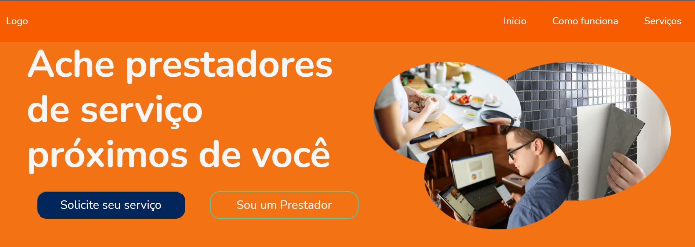

<h1 align="center">
  CASTERIZZI  :beaver:
</h1>

  <a href="#-tecnologias">Tecnologias</a>&nbsp;&nbsp;&nbsp;|&nbsp;&nbsp;&nbsp;
  <a href="#-projeto">Projeto</a>&nbsp;&nbsp;&nbsp;|&nbsp;&nbsp;&nbsp;
  <a href="#-layout">Layout</a>&nbsp;&nbsp;&nbsp;|&nbsp;&nbsp;&nbsp;
  <a href="#-layout">Equipe</a>&nbsp;&nbsp;&nbsp;|&nbsp;&nbsp;&nbsp;
  <a href="#memo-licença">Licença</a>

 

  

## 💻 Tecnologias

Esse projeto foi desenvolvido com as seguintes tecnologias:

  
  
  

  

## 💭 Projeto

 CASTORIZZI é empresa focada em conectar freelancer com clientes de seu bairro e região de uma forma rápida e fácil, permitiremos o compartilhamento de serviços concluídos como se fosse uma rede social, permitiremos também que o colaborador coloque o peço nos serviços que oferecem, tanto colaborador como cliente poderão classificar um ao outro para que possam ter a melhor experiencia possível dentro de nossa plataforma.   

## 🎨 Layout

Você pode visualizar o layout do projeto através [desse link](<https://www.figma.com/file/Nemzf260c2aJU9SqmISVPD/Demoday?node-id=2%3A5>). É necessário ter conta no [Figma](https://figma.com) para acessá-lo.

  

## 👨‍👩‍👦‍👦 Equipe:
- [Brenda](https://github.com/brendamamede)
- [Camille](https://github.com/camioliveira24)
- [Carolina](https://github.com/Carolina-Silva)
- [Gustavo](https://github.com/Gustavo-oli)
- [Railson](https://github.com/RailsonCosta)
- [Ramon](https://github.com/RamonDiego00)
- [ítalo](https://github.com/ItalodsOliveira)

  

## :memo: Licença
Esse projeto está sob a licença MIT. Veja o arquivo [LICENSE](.github/LICENSE.md) para mais detalhes.

---

Feito com 🧡 by Casterizzi [Para saber mais clique aqui]()

